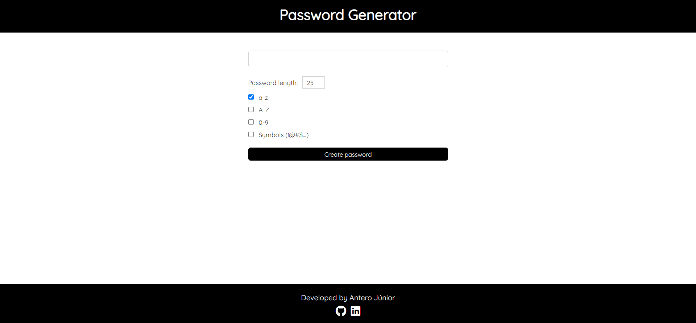

# Password generator

## How to use it

First, you must choose what kind of characters will be present on your password, you have four options: lower letters, upper letters, numbers and symbols.
<strong>You must choose at least one option!</strong>

And then you click 'Create password'.
Copy your new password or click 'Create password' again to get a new one.

## Knowledge

- [ ] React State (Hooks);
